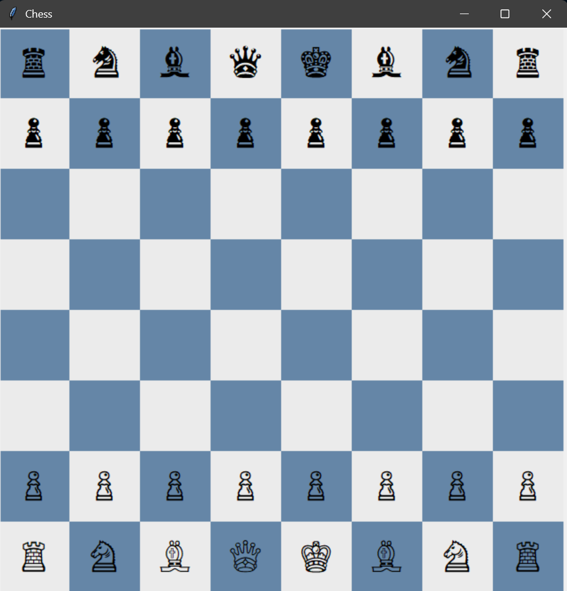

# Tkinter Chess Game

A very basic interactive chess game built using **Python** and **Tkinter**.

---

## Features

- Fully interactive 8×8 chessboard
- Click a piece to select it, then click a square to move
- Standard chess pieces with basic moves
- Turn-based: White and Black alternate
- Capturing a king ends the game
- Simple pawn promotion to queen
- Beginner-friendly code

> **Note:** No castling, en passant, or check/checkmate detection for simplicity

---

## Screenshot



---

## Run from Source

If you want to run the game from Python source:

1. Make sure you have **Python 3.x** installed
2. Open your terminal and navigate to the project folder
3. Run:

```bash
python main.py
```

## Windows Executable

You can run the game directly without Python using the Windows executable:

File: ```chess.exe``` (in the main project folder)
Just double-click it to launch the game.


## Project Structure
```
ChessGame/
├─ main.py          # Main game script
├─ board.py         # Board logic
├─ pieces.py        # Piece definitions and movement logic
├─ README.md        # This file
├─ chess.exe        # Windows executable
├─ chess_ss.png     # Screenshot of the game
└─ .gitignore       # Ignored files/folders
```

## Contributing

Feel free to fork the repo and add features like:

    Castling

    En passant

    Check/checkmate detection

    Improved GUI styling
    

## License

This project is free to use for learning and personal purposes.